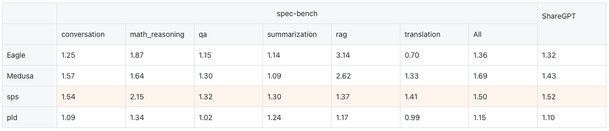
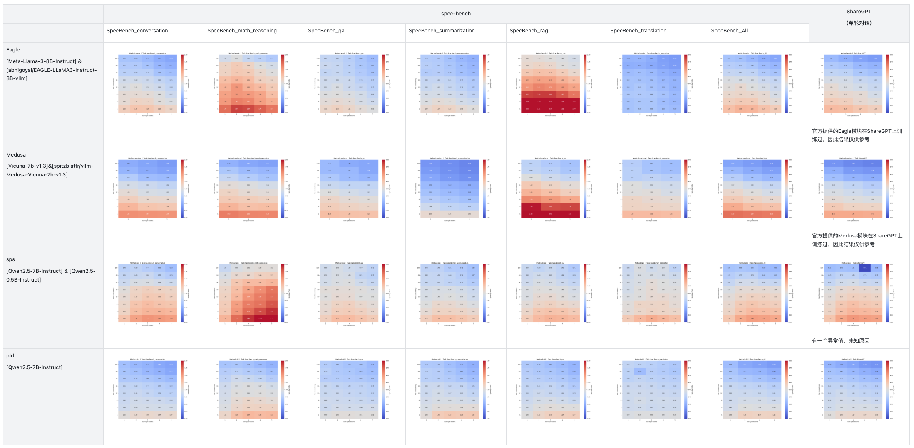
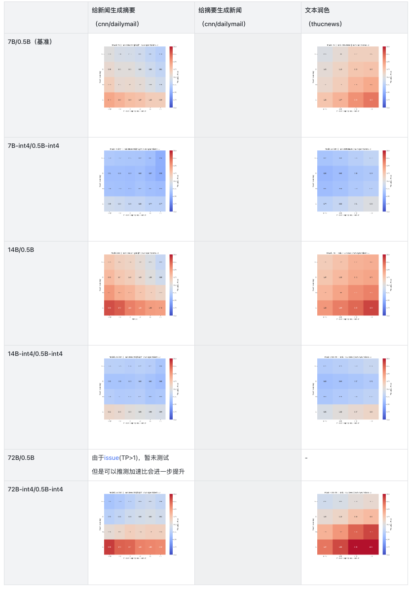

    <h1 align="center" style="margin-bottom:0px;">⏱︎&nbsp;spec-bench-vllm&nbsp;⏱︎</h1>
    <h6 align="center">Some tests on speculative decoding in vllm</h6>

 
**(update)⚠️ 注意：本仓库中的全部后续测试均在 vllm v0 上进行，所以结果仅供参考！**

参考：
- [spec-bench](https://github.com/hemingkx/Spec-Bench) ：这个工作测试了各种推测解码方法在 batchsize=1 下，在不同下游任务中相较于不用推测解码的加速比，并提供了一个在相同环境中对现有开源推测解码方法进行系统评估的平台。（使用各种推测解码方法的原始仓库实现）
- [[vLLM vs TensorRT-LLM] #11. Speculative Decoding -Daehyun Ahn,Yeonjoon Jung](https://blog.squeezebits.com/vllm-vs-tensorrtllm-11-speculative-decoding-37301)：这个帖子使用 Dynamic-Sonnet 数据集、Llama-3.1-70B-Struct/ Qwama-0.5B-Instruct 模型在 vllm 和 Tensorrt-llm 框架中测试了原版推测解码方法，并展示了详尽的图表和测试思路。

## 📁 概览

该测试分为三个阶段，
- 第一阶段的测试旨在评估截止2025年1月的各种推测解码方法（原始方法，Eagle，Medusa 等）在 vllm 中的表现
- 第二阶段的测试旨在评估推测解码在更长上下文、不同参数量目标模型、量化目标模型中的表现
- 第三阶段的测试旨在评估推测解码在混合长度数据集下，不同--speculative-disable-by-batch-size、 --speculative-max-model-len 等 server 参数的表现

**测试环境**
- 操作系统：Rocky Linux 9.2 (Blue Onyx)
- cpu: Intel(R) Xeon(R) Platinum 8358P CPU @ 2.60GHz
- gpu: 1x NVIDIA A100-SXM4-80GB
- vllm 0.6.6 post1

## 📂 测试一：各种推测解码方法

该轮测试的目的是评估截止2025年1月各种主流推测解码方法（原始方法，Eagle，Medusa 等）在 vllm 中的表现，代码位于 [Round-1]stress_test_all_methods 中。

### 数据集
- Spec-bench 使用的数据集 ([link](https://github.com/hemingkx/Spec-Bench/blob/main/data/spec_bench/question.jsonl))，位于 datasets/spec-bench/
- Sharegpt 的一个小子集，具有1024个单轮对话样本，位于 datasets/sharegpt_processed_1024.json

### 测试的方法［注：所有方法均使用 vllm 的实现，而非原始仓库中的实现]
- eagle [[原始仓库]](https://github.com/SafeAILab/EAGLE) [[vllm implementation]](https://github.com/vllm-project/vllm/blob/main/vllm/model_executor/models/eagle.py) + Llama3-8b
- medusa [[原始仓库]](https://github.com/FasterDecoding/Medusa) [[vllm implementation]](https://github.com/vllm-project/vllm/blob/main/vllm/model_executor/models/medusa.py) + Vicuna-7b
- sps (原始的推测解码方法，使用一个同系列小模型作为草稿模型) + Qwen2.5-7b
- pld (prompt lookup decoding) [[原始仓库]](https://github.com/apoorvumang/prompt-lookup-decoding)+ Qwen2.5-7b
- vanilla (单独使用大模型，不使用推测解码)

⚠️ 注意：由于测试在 vllm 框架中进行，vllm 中这些方法的实现和原始实现有一些区别，包括但不限于：
- ✅ vllm 中所有的推测解码方法均支持任意 batchsize 的批处理
- ⚠️ vllm 0.6.6 尚未支持 Medusa 和 Eagle 的 tree attention，这导致 Medusa 和 Eagle 在 vllm 中的加速比低于它们的原始仓库实现

### Vllm 参数说明
**关于 MQA / Batch Expansion**

目前 vllm 并未实现 MQA kernel，因此使用 Batch Expansion 达到在 cuda graph 中使用 MQA 的目的。

在测试中，只测试了使用 [Batch Expansion](https://github.com/vllm-project/vllm/blob/main/vllm/spec_decode/batch_expansion.py) 的设置，并未启用 [MQA](https://github.com/vllm-project/vllm/blob/main/vllm/spec_decode/mqa_scorer.py)（--enforce-eager），因为根据测试结果，在 batchsize 较低的场景下使用 MQA 的加速比明显低于使用 Batch Expansion 的加速比，这与 [pull#9298](https://github.com/vllm-project/vllm/pull/9298) 的实验结果一致。而在 batchsize 较高的场景下，虽然使用 MQA 相比使用 Batch Expansion 有了加速，但此时使用推测解码的运行时间会大于不使用推测解码的运行时间（使用 Batch Expansion 进行推测解码>使用 MQA 进行推测解码>>不使用推测解码）。

### 测试结果

#### 表1 - Max Values

*注*：下表中每个单元格内的数值为“该方法相比不用推测解码的方法，在**不同吞吐量和草稿 tokens 数量下**能达到的**最大**加速比”，并不具有统一的参数限制，因此该表格中的数值只能反映理想设置下的峰值情况，真实情况下的加速比往往低于或远低于这个数值（见每个方法-下游任务的具体热力图）。

计算方式：**加速比 = 推测解码方法的`total_token_throughput` / 不用推测解码的`total_token_throughput`**，throughput 相关数值可以在压力测试脚本中获得，该压力测试脚本修改自：[vllm/blob/main/benchmarks/benchmark_serving.py](https://github.com/vllm-project/vllm/blob/main/benchmarks/benchmark_serving.py)

因为在实验中，发现 vllm 中即使设置了贪婪解码相关参数，也无法保证每次在相同数据集上生成的 tokens 数严格一致，实际上即使单独运行大模型也会导致每次运行生成的 tokens 数不一样（见 [issue#5404](https://github.com/vllm-project/vllm/issues/5404) 和 [issue#6735](https://github.com/vllm-project/vllm/issues/6735)） ，所以不使用`duration（second）`而是使用`throughput（tokens/second）`来计算加速比

#### 表2 - Throughput Speedup Heatmap

图片为概览，关于每个方法在每个子任务下的具体加速比图像，可以在 auto_test_results/online 的各个子文件夹里查看

### 🧷 复现测试结果

1、安装 vllm==0.6.6

    pip install vllm==0.6.6

- 如果和代码中一样使用 Qwen2.5 系列模型，需要参考这个 [issue#5203](https://github.com/vllm-project/vllm/issues/5203) 将 vllm 源码中草稿模型和目标模型的词表大小对齐，vllm 目前只支持草稿模型和目标模型的词表大小相同
- 目前暂时无法在 vllm 中使用 eagle 方法运行 qwen 模型

2、进入第一轮测试的文件夹，生成存放测试结果的文件目录

    cd ./[Round-1]stress_test_all_methods/auto_test_code
    python init_file_dir.py

3、修改 `globals.py` 里的数据集路径、python 执行文件路径等；修改 `main_{METHOD}.py` 里的 `model_path`、`speculative_model_path` 为你的本地模型路径

运行 `main_{METHOD}.py` 脚本以使用不同方法进行测试，该脚本会首先使用 subprocess 开启一个 vllm 服务的子进程，随后在不同的任务数据集（spec-bench 或 sharegpt）上自动运行压力测试，统计在不同并发数下的推测解码加速比。

*因为每次改变草稿 tokens 数量（--num-spec-tokens）会导致重新开启 vllm 服务，因此将它放在了最外层循环

    python main_{METHOD}.py

测试结果默认会存入 init_file_dir.py 里生成的 `./auto_test_results/online/{METHOD}/{Task Name}/Table_MaxConcurrency.jsonl` 路径下，可以在 `main_{METHOD}.py` 脚本中修改该路径。

4、绘制测试结果

    cd ../
    python [Round-1]draw_chart.py

这会在每个 `./auto_test_results/online/{METHOD}/{Task Name}` 路径下各生成一张反映加速比的热力图，并且在 `./auto_test_results/online/max_speedup.jsonl` 中追加该方法在该测试集上能达到的最大加速比及对应参数，如：

    {"method": "eagle", "task": "ShareGPT", "num_spec_tokens": 2, "max_concurrency": 1, "speedup_ratio": 1.3179586746512673}

 

## 📂 测试二：不同参数量目标模型、不同上下文长度

该轮测试的目的是评估推测解码在更长上下文、不同参数量目标模型、量化目标模型中的表现，代码位于 [Round-2]stress_test_sps_only 中。

- 并未对模型生成的文本进行质量评估
- num_spec_tokens 固定为3
- 关于量化方法：测试了 GPTQ-int4 和 AWQ-int4，发现 AWQ 的草稿接受率在现有任务下一般略高于 GPTQ（高0.05～0.09不等），因此最终选择 AWQ

### 模型与数据集

该测试分为3个下游任务：

- 给新闻生成摘要（多 prefill，少 decode）
  - prompt tokens：["0.25k", "0.5k", "1k", "2k", "4k", "8k"]
  - output tokens：2k及以下-128，4k-256，8k-512
  - 数据集：datasets/CNN-DailyMail-News/

- 给摘要生成新闻（少 prefill，多 decode）
  - prompt tokens：64～128
  - output tokens：["0.25k", "0.5k", "1k", "2k", "4k", "8k"]
  - 数据集：datasets/CNN-DailyMail-HighLights/

- 文本润色（prefill 与 decode 字数大致相同）
  - prompt tokens：["0.125k", "0.25k", "0.5k", "1k", "2k", "4k"]
  - output tokens：["0.125k", "0.25k", "0.5k", "1k", "2k", "4k"]
  - 数据集：datasets/THUCNews/

模型均为 Qwen 2.5-Instruct 系列

注1：因为 cnn-dailymail 原始数据集的单条新闻长度普遍在 2k 以下，在 4k 及以上长度的测试文件中，单条样本所包含的新闻为2条以上原始数据集中的新闻拼接而成

注2：通过在 client 发送的 SamplingParams 里指定“min_tokens”来指定模型一次最少生成多少字符，在生成这些数量的字符之前不会生成EOS

### 测试结果

⚠️ 在测试中，我们发现即使是 Qwen2.5-72B-Instruct 也总是在指定生成超过 1k tokens（SamplingParams.min_tokens > 1000）的情况下生成垃圾字符。因此最终并没有测试[根据摘要生成新闻]的任务，并且在文本润色任务中只测试了output tokens为 ["0.125k", "0.25k", "0.5k", "1k"] 的结果。

#### Throughput Speedup Heatmap

图片为概览，关于每个方法在每个子任务下的具体加速比图像，可以在 auto_test_results/online 的各个子文件夹里查看

关于接受率：target 模型增大，草稿接受率会稍稍降低，但总体而言 system efficiency 都很高（8k上下文约0.5～0.6)

### 🧷 复现测试结果

1、安装 vllm==0.6.6

    pip install vllm==0.6.6

- 如果和代码中一样使用 Qwen2.5 系列模型，需要参考这个 [issue#5203](https://github.com/vllm-project/vllm/issues/5203) 将 vllm 源码中草稿模型和目标模型的词表大小对齐，vllm 目前只支持草稿模型和目标模型的词表大小相同
- 目前暂时无法在 vllm 中使用 eagle 方法运行 qwen 模型

2、进入第二轮测试的文件夹，生成存放测试结果的文件目录

    cd ./[Round-2]stress_test_sps_only/auto_test_code
    python init_file_dir.py

3、修改 `globals.py` 里的数据集路径、python 执行文件路径等；修改 `example_{MODEL_TYPE}.py` 里的 `model_path`、`speculative_model_path` 为你的本地模型路径

运行 `example_{MODEL_TYPE}.py` 脚本以使用不同方法进行测试，该脚本会首先使用 subprocess 开启一个 vllm 服务的子进程，随后依次遍历不同任务-不同上下文长度的数据集，自动运行压力测试，统计在不同并发数下的推测解码加速比。

    python example_{MODEL_TYPE}.py

测试结果默认会存入 init_file_dir.py 里生成的 `./auto_test_results/online/{MODEL_TYPE}/{Task Name}/Table_MaxConcurrency.jsonl` 路径下，可以在 `example_{MODEL_TYPE}.py` 脚本中修改该路径。

4、绘制测试结果

    cd ../
    python [Round-2]draw_chart.py

这会在每个 `./auto_test_results/online/{METHOD}/{Task Name}` 路径下各生成一张反映加速比的热力图。

 

## 📂 测试三：不同 server 参数

该轮测试的目的是评估推测解码在混合长度数据集下，不同推测解码相关 server 参数的表现，代码位于 [Round-3]stress_test_best_params 中。

### 模型与数据集

- 模型：Qwen2.5-14B-Instruct / Qwen2.5-0.5B-Instruct
- 数据集：位于`./datasets/Spec-Decode-Merged/cnn_merged.jsonl`，该文件中每20个样本为一个长度，例如1～20个样本为256， 21～40个样本为512... 100~120个样本为8k。
  
### 🧷 运行测试

1、安装 vllm==0.6.6

    pip install vllm==0.6.6

- 如果和代码中一样使用 Qwen2.5 系列模型，需要参考这个 [issue#5203](https://github.com/vllm-project/vllm/issues/5203) 将 vllm 源码中草稿模型和目标模型的词表大小对齐，vllm 目前只支持草稿模型和目标模型的词表大小相同
- 目前暂时无法在 vllm 中使用 eagle 方法运行 qwen 模型

2、进入第三轮测试的文件夹

    cd ./[Round-3]stress_test_best_params/manual_test_code

3、测试文件位于 [NVTX]run_manual_stress_test.py ，该脚本会使用 multiprocessing 同时开启2个 vllm 服务的进程，一个用推测解码，一个不用推测解码。可以调试 `--speculative-disable-by-batch-size`、`.--speculative-max-model-len`、`--enable-chunked-prefill` 等参数

一个参考 nsys 命令如下：

    sudo -E nsys profile \
    --gpu-metrics-device="4,5" \
    --trace="cuda,nvtx" \
    --cuda-graph-trace="graph" \
    --cuda-memory-usage="true" \
    --delay="200" \
    --output="/PATH/TO/YOUR/Profile" \
    /PATH/TO/YOUR/python \
    "./[Round-3]stress_test_best_params/manual_test_code/[NVTX]run_manual_stress_test.py" 

